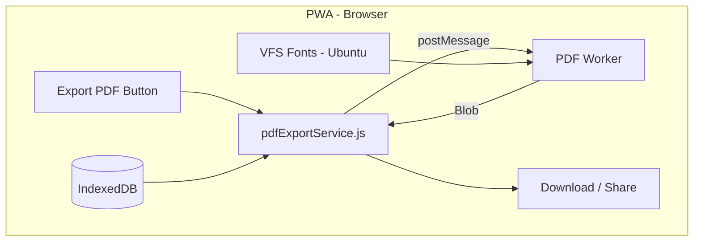

# pdfmake Offline PDF Export Architecture

> 100% offline client-side PDF generation using pdfmake with embedded fonts and Web Worker.

## User Review Required

> [!IMPORTANT]
> **No Server Required**: This approach generates PDFs entirely in the browser using pdfmake. Works offline, no backend needed.

> [!NOTE]
> **Bundle Size**: pdfmake (~300KB minified) + fonts (~200KB per weight) will add ~500KB-1MB to the app bundle. This is cached by the PWA service worker.

## Architecture Overview



### Data Flow

1. **User clicks "Export PDF"** → `pdfExportService` builds snapshot from IndexedDB
2. **Service posts snapshot** to Web Worker (avoids UI freeze)
3. **Worker loads pdfmake** + VFS fonts, builds `docDefinition`, calls `createPdf().getBlob()`
4. **Blob returned** via `postMessage` → Service triggers download or Web Share

---

## Key pdfmake Features Used

| Feature | Documentation | Usage |
|---------|---------------|-------|
| **VFS Fonts** | [Custom fonts via VFS](https://pdfmake.github.io/docs/0.1/fonts/custom-fonts-client-side/vfs/) | Embed Ubuntu fonts for consistency |
| **Tables** | [Tables](https://pdfmake.github.io/docs/0.1/document-definition-object/tables/) | Category items with `headerRows` |
| **Dynamic Footer** | [Headers and footers](https://pdfmake.github.io/docs/0.1/document-definition-object/headers-footers/) | `Page X of Y` |
| **getBlob()** | [Methods](https://pdfmake.github.io/docs/0.1/getting-started/client-side/methods/) | Return Blob for download |
| **Declarative** | [Document definition](https://pdfmake.github.io/docs/0.1/document-definition-object/) | JSON structure → PDF |

---

## Proposed Changes

### 1. Package Dependencies

#### [MODIFY] `app/package.json`

file:///Users/lucazanner/Documents/GitHub/PDF Tool/Gear-list-editor/app/package.json

Add pdfmake:
```json
{
  "dependencies": {
    "pdfmake": "^0.3.0"
  }
}
```

---

### 2. Folder Structure

```
app/src/
├── data/
│   └── pdf/
│       ├── snapshotTypes.js       # Export snapshot builder
│       ├── buildDocDefinition.js  # Snapshot → pdfmake docDefinition
│       ├── pdfExportService.js    # Main export API
│       ├── fonts/
│       │   ├── ubuntu-vfs.js      # Generated VFS (base64 fonts)
│       │   └── generate-vfs.mjs   # Build script
│       └── worker/
│           └── pdf.worker.js      # Web Worker for PDF generation
```

---

### 3. Snapshot Types

#### [NEW] `snapshotTypes.js`

file:///Users/lucazanner/Documents/GitHub/PDF Tool/Gear-list-editor/app/src/data/pdf/snapshotTypes.js

```javascript
/**
 * @typedef {Object} PdfExportSnapshot
 * @property {'1.0'} schemaVersion
 * @property {string} documentId
 * @property {string} createdAtISO
 * @property {string} locale
 * @property {Object} data
 * @property {import('../../types.js').Project} data.project
 * @property {{categories: number, items: number}} data.totals
 */

/**
 * Build deterministic export snapshot from project.
 * @param {import('../../types.js').Project} project
 * @param {string} locale
 * @returns {PdfExportSnapshot}
 */
export function buildExportSnapshot(project, locale) {
  const totals = {
    categories: project.categories.length,
    items: project.categories.reduce((sum, cat) => sum + cat.items.length, 0)
  };
  return {
    schemaVersion: '1.0',
    documentId: project.id,
    createdAtISO: new Date().toISOString(),
    locale,
    data: { project, totals }
  };
}
```

---

### 4. Document Definition Builder

#### [NEW] `buildDocDefinition.js`

file:///Users/lucazanner/Documents/GitHub/PDF Tool/Gear-list-editor/app/src/data/pdf/buildDocDefinition.js

Converts snapshot → pdfmake `docDefinition`:

```javascript
/**
 * Build pdfmake document definition from export snapshot.
 * @param {import('./snapshotTypes.js').PdfExportSnapshot} snapshot
 * @param {(key: string, fallback?: string) => string} t - Translation function
 * @returns {Object} pdfmake docDefinition
 */
export function buildDocDefinition(snapshot, t) {
  const { project, totals } = snapshot.data;
  
  // Build category tables
  const categoryContent = project.categories.flatMap((category, idx) => [
    // Category header
    { text: category.name || `Category ${idx + 1}`, style: 'categoryHeader', margin: [0, 16, 0, 8] },
    // Items table
    {
      table: {
        headerRows: 1,
        widths: [40, 40, '*', '*'],
        body: [
          // Header row
          [
            { text: t('items.print.headers.quantity', 'Qty'), style: 'tableHeader' },
            { text: t('items.print.headers.unit', 'Unit'), style: 'tableHeader' },
            { text: t('items.print.headers.item', 'Item'), style: 'tableHeader' },
            { text: t('items.print.headers.details', 'Details'), style: 'tableHeader' }
          ],
          // Data rows
          ...category.items.map(item => [
            { text: String(item.quantity), alignment: 'center' },
            { text: item.unit || 'pcs' },
            { text: item.name || '' },
            { text: item.details || '', color: '#64748b' }
          ])
        ]
      },
      layout: 'lightHorizontalLines'
    }
  ]);

  return {
    pageSize: 'A4',
    pageMargins: [45, 60, 45, 60], // ~16mm margins in points
    
    // Dynamic footer with page numbers
    footer: (currentPage, pageCount) => ({
      text: `Page ${currentPage} / ${pageCount}`,
      alignment: 'center',
      fontSize: 10,
      color: '#64748b',
      margin: [0, 20, 0, 0]
    }),
    
    content: [
      // Title
      { text: project.name || 'Gear List', style: 'title' },
      
      // Metadata grid
      {
        columns: [
          { text: `${t('project.print.labels.client', 'Client')}: ${project.client || '—'}`, width: '50%' },
          { text: `${t('project.print.labels.date', 'Date')}: ${project.shootDate || '—'}`, width: '50%' }
        ],
        margin: [0, 8, 0, 0]
      },
      {
        columns: [
          { text: `${t('project.print.labels.location', 'Location')}: ${project.location || '—'}`, width: '50%' },
          { text: `${t('project.print.labels.contact', 'Contact')}: ${project.contact || '—'}`, width: '50%' }
        ],
        margin: [0, 4, 0, 16]
      },
      
      // Horizontal line
      { canvas: [{ type: 'line', x1: 0, y1: 0, x2: 505, y2: 0, lineWidth: 1, lineColor: '#0f172a' }] },
      
      // Categories
      ...categoryContent,
      
      // Notes section
      { text: t('project.print.notes.title', 'Notes'), style: 'categoryHeader', margin: [0, 24, 0, 8] },
      { text: project.notes || t('project.notes.empty', 'No notes added.'), color: '#475569' }
    ],
    
    styles: {
      title: { fontSize: 22, bold: true, margin: [0, 0, 0, 8] },
      categoryHeader: { fontSize: 12, bold: true, color: '#0f172a' },
      tableHeader: { bold: true, fillColor: '#e2e8f0', color: '#0f172a' }
    },
    
    defaultStyle: {
      font: 'Ubuntu',
      fontSize: 10,
      color: '#0f172a'
    }
  };
}
```

---

### 5. VFS Font Generation

#### [NEW] `fonts/generate-vfs.mjs`

file:///Users/lucazanner/Documents/GitHub/PDF Tool/Gear-list-editor/app/src/data/pdf/fonts/generate-vfs.mjs

Build script to generate VFS from font files:

```javascript
#!/usr/bin/env node
import { readFileSync, writeFileSync } from 'fs';
import { join, dirname } from 'path';
import { fileURLToPath } from 'url';

const __dirname = dirname(fileURLToPath(import.meta.url));

// Font files to embed (adjust paths when fonts are added)
const fonts = {
  'Ubuntu-Regular.ttf': 'assets/fonts/Ubuntu-Regular.ttf',
  'Ubuntu-Bold.ttf': 'assets/fonts/Ubuntu-Bold.ttf',
  'Ubuntu-Italic.ttf': 'assets/fonts/Ubuntu-Italic.ttf',
  'Ubuntu-BoldItalic.ttf': 'assets/fonts/Ubuntu-BoldItalic.ttf',
};

const vfs = {};
for (const [filename, relativePath] of Object.entries(fonts)) {
  const fontPath = join(__dirname, '../../../../', relativePath);
  const data = readFileSync(fontPath);
  vfs[filename] = data.toString('base64');
}

const output = `// Auto-generated - do not edit
export const ubuntuVfs = ${JSON.stringify(vfs, null, 2)};
`;

writeFileSync(join(__dirname, 'ubuntu-vfs.js'), output);
console.log('✅ Generated ubuntu-vfs.js');
```

#### [NEW] npm script

Add to `app/package.json`:
```json
{
  "scripts": {
    "gen:pdf-fonts": "node src/data/pdf/fonts/generate-vfs.mjs"
  }
}
```

---

### 6. PDF Web Worker

#### [NEW] `worker/pdf.worker.js`

file:///Users/lucazanner/Documents/GitHub/PDF Tool/Gear-list-editor/app/src/data/pdf/worker/pdf.worker.js

```javascript
import pdfMake from 'pdfmake/build/pdfmake';
import pdfFonts from 'pdfmake/build/vfs_fonts';
import { ubuntuVfs } from '../fonts/ubuntu-vfs.js';

// Merge default Roboto VFS with Ubuntu VFS
pdfMake.vfs = {
  ...(pdfFonts?.pdfMake?.vfs ?? {}),
  ...ubuntuVfs
};

// Register Ubuntu font family
pdfMake.fonts = {
  Roboto: {
    normal: 'Roboto-Regular.ttf',
    bold: 'Roboto-Medium.ttf',
    italics: 'Roboto-Italic.ttf',
    bolditalics: 'Roboto-MediumItalic.ttf'
  },
  Ubuntu: {
    normal: 'Ubuntu-Regular.ttf',
    bold: 'Ubuntu-Bold.ttf',
    italics: 'Ubuntu-Italic.ttf',
    bolditalics: 'Ubuntu-BoldItalic.ttf'
  }
};

self.onmessage = (event) => {
  const { docDefinition } = event.data;
  
  try {
    pdfMake.createPdf(docDefinition).getBlob((blob) => {
      self.postMessage({ success: true, blob });
    });
  } catch (error) {
    self.postMessage({ success: false, error: error.message });
  }
};
```

---

### 7. PDF Export Service

#### [NEW] `pdfExportService.js`

file:///Users/lucazanner/Documents/GitHub/PDF Tool/Gear-list-editor/app/src/data/pdf/pdfExportService.js

```javascript
import { buildExportSnapshot } from './snapshotTypes.js';
import { buildDocDefinition } from './buildDocDefinition.js';

/**
 * Export project as PDF.
 * @param {import('../../types.js').Project} project
 * @param {string} locale
 * @param {(key: string, fallback?: string) => string} t - Translation function
 * @returns {Promise<void>}
 */
export async function exportPdf(project, locale, t) {
  // Build snapshot and doc definition
  const snapshot = buildExportSnapshot(project, locale);
  const docDefinition = buildDocDefinition(snapshot, t);
  
  // Generate PDF in worker
  const blob = await generatePdfInWorker(docDefinition);
  
  // Download
  downloadBlob(blob, `${project.name || 'gear-list'}.pdf`);
}

/**
 * Generate PDF blob in Web Worker.
 * @param {Object} docDefinition
 * @returns {Promise<Blob>}
 */
function generatePdfInWorker(docDefinition) {
  return new Promise((resolve, reject) => {
    const worker = new Worker(
      new URL('./worker/pdf.worker.js', import.meta.url),
      { type: 'module' }
    );
    
    worker.onmessage = (event) => {
      worker.terminate();
      if (event.data.success) {
        resolve(event.data.blob);
      } else {
        reject(new Error(event.data.error));
      }
    };
    
    worker.onerror = (error) => {
      worker.terminate();
      reject(error);
    };
    
    worker.postMessage({ docDefinition });
  });
}

/**
 * Download blob as file.
 * @param {Blob} blob
 * @param {string} filename
 */
function downloadBlob(blob, filename) {
  const url = URL.createObjectURL(blob);
  const link = document.createElement('a');
  link.href = url;
  link.download = filename;
  document.body.appendChild(link);
  link.click();
  link.remove();
  URL.revokeObjectURL(url);
}
```

---

### 8. Client Integration

#### [MODIFY] `App.jsx`

file:///Users/lucazanner/Documents/GitHub/PDF Tool/Gear-list-editor/app/src/App.jsx

Replace `exportPdf` callback:

```javascript
import { exportPdf } from './data/pdf/pdfExportService.js';

const handleExportPdf = useCallback(async (project, index) => {
  setStatus(t('status.pdfExporting', 'Generating PDF...'));
  try {
    await exportPdf(project, locale, t);
    setStatus(t('status.pdfExportComplete', 'PDF downloaded successfully.'));
  } catch (err) {
    console.error('PDF export failed:', err);
    setStatus(t('status.pdfExportError', 'PDF generation failed. Please try again.'));
  }
}, [locale, setStatus, t]);
```

---

### 9. i18n Updates

#### [MODIFY] `en.json` / `de.json`

file:///Users/lucazanner/Documents/GitHub/PDF Tool/Gear-list-editor/app/src/i18n/en.json

Add under `status`:
```json
{
  "pdfExporting": "Generating PDF...",
  "pdfExportComplete": "PDF downloaded successfully.",
  "pdfExportError": "PDF generation failed. Please try again."
}
```

---

### 10. Font Assets (Placeholder)

#### [NEW] Font directory

file:///Users/lucazanner/Documents/GitHub/PDF Tool/Gear-list-editor/app/assets/fonts/

Create directory and add Ubuntu fonts when available:
- `Ubuntu-Regular.ttf`
- `Ubuntu-Bold.ttf`
- `Ubuntu-Italic.ttf`
- `Ubuntu-BoldItalic.ttf`
- `LICENSE.txt` (Ubuntu Font Licence)

> User will provide font files later. For now, can use Roboto (bundled with pdfmake) as fallback.

---

## Verification Plan

### Automated Tests (Vitest)

| Test File | Description | Command |
|-----------|-------------|---------|
| `app/test/unit/snapshotTypes.test.js` | Verify `buildExportSnapshot` produces valid schema | `cd app && npm test` |
| `app/test/unit/buildDocDefinition.test.js` | Verify docDefinition structure for categories/items | `cd app && npm test` |

**Existing test setup:** `app/test/setup.js` confirms Vitest is configured.

### Manual Verification

**Prerequisites:**
```bash
cd app
npm install pdfmake
npm run dev
```

**Test Steps:**

| Step | Action | Expected |
|------|--------|----------|
| 1 | Open `http://localhost:5173/Gear-list-editor/` | App loads |
| 2 | Create new project "Test Export" with client, date, location, contact | Project saved |
| 3 | Add category "Camera" with 2 items: "Camera Body" (qty 1), "Lenses" (qty 3) | Items visible |
| 4 | Click "Export PDF" | Status shows "Generating PDF..." |
| 5 | Wait for download | PDF `Test Export.pdf` downloads |
| 6 | Open PDF | Contains: title, metadata, category table, page numbers |
| 7 | **Offline test**: DevTools → Network → Offline, click Export PDF | PDF still generates and downloads |

### Comparison to Existing Output

Compare structure to existing `buildPrintableHtml` output:
- Same metadata fields (client, date, location, contact)
- Same table columns (Qty, Unit, Item, Details)
- Page footer with page numbers

---

## Implementation Phases

### Phase 1: Package Setup (Est. 15 min)
1. Install pdfmake
2. Create `app/src/data/pdf/` directory structure

### Phase 2: Core Implementation (Est. 45 min)
1. Create `snapshotTypes.js`
2. Create `buildDocDefinition.js`
3. Create `pdfExportService.js`
4. Create `pdf.worker.js`

### Phase 3: Font Setup (Est. 20 min)
1. Create `generate-vfs.mjs` script
2. Add placeholder with Roboto fallback
3. Add npm script
4. (Later: integrate Ubuntu fonts when provided)

### Phase 4: Integration (Est. 20 min)
1. Update `App.jsx` export callback
2. Add i18n keys
3. Remove old print.js dependency (optional - can keep as backup)

### Phase 5: Tests + Verification (Est. 30 min)
1. Write unit tests
2. Manual browser test
3. Offline test
4. Compare output to example PDFs

---

## Notes

### Byte-Identical PDFs?
pdfmake adds `creationDate` metadata automatically. PDFs will be **visually identical** but not **byte-identical** across runs. Regression tests should compare visually or ignore metadata.

### Bundle Size Optimization
Consider lazy loading pdfmake only when export is triggered (dynamic import in worker).

### Web Share API (Optional Enhancement)
After getting blob, can offer share via `navigator.share({ files: [new File([blob], 'gear-list.pdf')] })` on supported devices.
