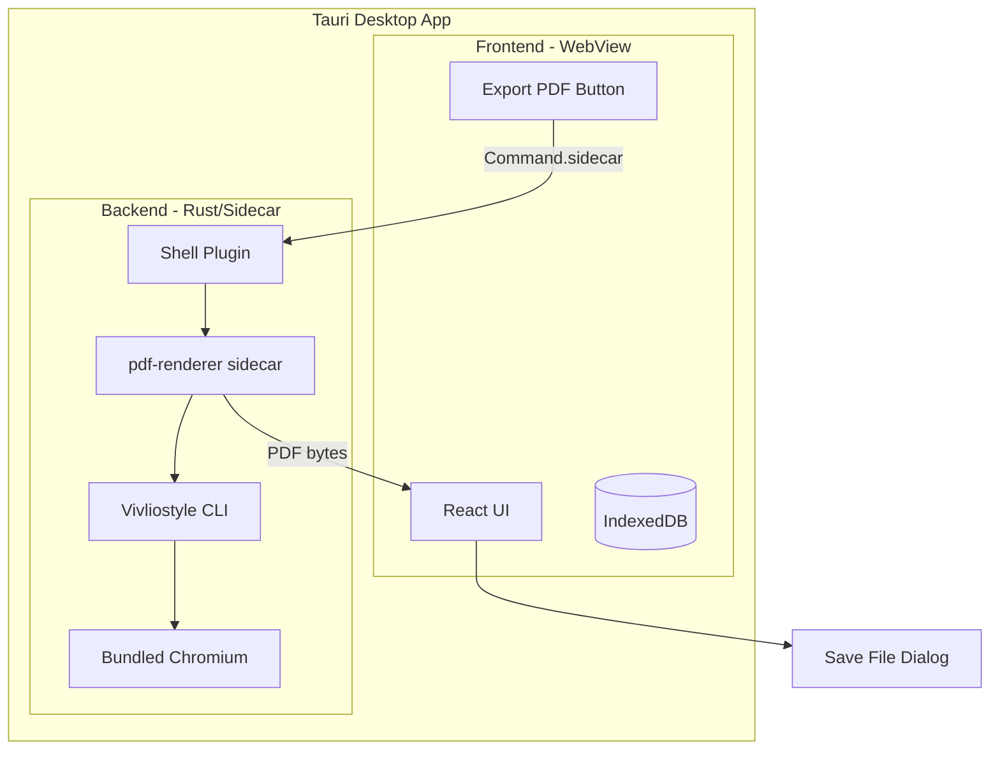

# Tauri Desktop PDF Architecture with Bundled Vivliostyle

> Convert the Gear List Editor PWA into a Tauri desktop app with bundled Vivliostyle CLI for 100% offline, consistent PDF exports.

## User Review Required

> [!IMPORTANT]
> **App Distribution Change**: This architecture converts the PWA to a native desktop app (installer for macOS/Windows/Linux). The app can still run as a web app in development, but production PDF export requires the Tauri runtime.

> [!WARNING]
> **Build Complexity**: Requires Rust toolchain, Node.js 20+, and platform-specific build tools (Xcode CLI on macOS, MSVC on Windows).

> [!CAUTION]
> **Asset Bundling**: Fonts must be bundled in the app (Google Fonts won't work offline). CSS/HTML templates bundled as Tauri resources.

## Architecture Overview



### Data Flow

1. **User clicks "Export PDF"** → React builds export snapshot JSON
2. **Tauri shell plugin** invokes `pdf-renderer` sidecar with snapshot as argument
3. **Sidecar** (Node.js SEA binary) receives snapshot, writes temp HTML + CSS
4. **Vivliostyle CLI** (bundled inside sidecar) renders → PDF
5. **PDF bytes** returned via stdout → Tauri saves to user-selected path

---

## Key Technologies

| Component | Technology | Purpose |
|-----------|------------|---------|
| Desktop Framework | Tauri v2 | Cross-platform app container |
| Frontend | Existing React app | No changes to UI logic |
| PDF Renderer | `@vivliostyle/cli` | CSS typesetting |
| Node Bundler | Node.js SEA (v20+) | Single executable sidecar |
| Build Tool | esbuild | Bundle renderer script |
| Shell Plugin | `@tauri-apps/plugin-shell` | Execute sidecar from JS |

### Sidecar Strategy

Bundle a **Node.js Single Executable Application (SEA)** containing:
- Main rendering script
- Bundled `@vivliostyle/cli` (via esbuild)
- Print CSS template as embedded asset

The sidecar is named with target-triple suffix:
- `pdf-renderer-x86_64-unknown-linux-gnu`
- `pdf-renderer-aarch64-apple-darwin`
- `pdf-renderer-x86_64-pc-windows-msvc.exe`

---

## Proposed Changes

### 1. Tauri Project Setup

#### [NEW] `src-tauri/` directory

file:///Users/lucazanner/Documents/GitHub/PDF Tool/Gear-list-editor/src-tauri/

```
src-tauri/
├── Cargo.toml
├── tauri.conf.json
├── capabilities/
│   └── default.json
├── src/
│   └── lib.rs
├── binaries/           # Sidecar binaries (per platform)
│   └── pdf-renderer-{target-triple}[.exe]
└── resources/
    └── templates/
        └── gear-list-v1/
            ├── print.css
            └── Inter-Variable.woff2   # Bundled font
```

#### [NEW] `src-tauri/tauri.conf.json`

file:///Users/lucazanner/Documents/GitHub/PDF Tool/Gear-list-editor/src-tauri/tauri.conf.json

Key configuration:
```json
{
  "$schema": "https://schema.tauri.app/config/2",
  "productName": "Gear List Editor",
  "identifier": "com.gearlist.editor",
  "build": {
    "frontendDist": "../app/dist"
  },
  "bundle": {
    "externalBin": ["binaries/pdf-renderer"],
    "resources": ["resources/**/*"]
  },
  "plugins": {
    "shell": {}
  }
}
```

#### [NEW] `src-tauri/capabilities/default.json`

file:///Users/lucazanner/Documents/GitHub/PDF Tool/Gear-list-editor/src-tauri/capabilities/default.json

```json
{
  "$schema": "../gen/schemas/desktop-schema.json",
  "identifier": "default",
  "windows": ["main"],
  "permissions": [
    "core:default",
    {
      "identifier": "shell:allow-execute",
      "allow": [{
        "name": "binaries/pdf-renderer",
        "sidecar": true,
        "args": [{ "validator": ".*" }]
      }]
    },
    "dialog:allow-save"
  ]
}
```

---

### 2. PDF Renderer Sidecar

#### [NEW] `pdf-renderer/` package

file:///Users/lucazanner/Documents/GitHub/PDF Tool/Gear-list-editor/pdf-renderer/

```
pdf-renderer/
├── package.json
├── sea-config.json
├── src/
│   ├── index.js          # Main entry (reads stdin, invokes vivliostyle)
│   └── template.js       # HTML generation
├── assets/
│   ├── print.css
│   └── Inter-Variable.woff2
└── scripts/
    ├── build-sea.js      # Build single executable
    └── rename-binary.js  # Add target-triple suffix
```

#### [NEW] `pdf-renderer/package.json`

file:///Users/lucazanner/Documents/GitHub/PDF Tool/Gear-list-editor/pdf-renderer/package.json

```json
{
  "name": "pdf-renderer",
  "type": "module",
  "version": "1.0.0",
  "scripts": {
    "build:bundle": "esbuild src/index.js --bundle --platform=node --outfile=dist/renderer.cjs --format=cjs",
    "build:sea": "node scripts/build-sea.js",
    "build": "npm run build:bundle && npm run build:sea"
  },
  "dependencies": {
    "@vivliostyle/cli": "^10.1.0"
  },
  "devDependencies": {
    "esbuild": "^0.24.0"
  }
}
```

#### [NEW] `pdf-renderer/src/index.js`

file:///Users/lucazanner/Documents/GitHub/PDF Tool/Gear-list-editor/pdf-renderer/src/index.js

Main sidecar logic:
```javascript
// Read snapshot JSON from argv[2] (base64 encoded)
const snapshotB64 = process.argv[2];
const snapshot = JSON.parse(Buffer.from(snapshotB64, 'base64').toString());

// Create temp directory
// Write index.html from template
// Copy bundled print.css + fonts
// Generate vivliostyle.config.js
// Run vivliostyle build
// Output PDF bytes to stdout
```

#### [NEW] `pdf-renderer/scripts/build-sea.js`

file:///Users/lucazanner/Documents/GitHub/PDF Tool/Gear-list-editor/pdf-renderer/scripts/build-sea.js

Automates Node.js SEA creation:
1. Generate `sea-prep.blob` from bundled script
2. Copy Node.js binary
3. Remove signature (macOS/Windows)
4. Inject blob with `postject`
5. Re-sign (macOS)
6. Rename with target-triple suffix

---

### 3. Client Integration

#### [MODIFY] `app/package.json`

file:///Users/lucazanner/Documents/GitHub/PDF Tool/Gear-list-editor/app/package.json

Add Tauri dependencies:
```json
{
  "devDependencies": {
    "@tauri-apps/cli": "^2.3.0",
    "@tauri-apps/api": "^2.3.0",
    "@tauri-apps/plugin-shell": "^2.2.0",
    "@tauri-apps/plugin-dialog": "^2.2.0"
  },
  "scripts": {
    "tauri": "tauri",
    "tauri:dev": "tauri dev",
    "tauri:build": "tauri build"
  }
}
```

#### [NEW] `app/src/data/pdf/tauriPdfService.js`

file:///Users/lucazanner/Documents/GitHub/PDF Tool/Gear-list-editor/app/src/data/pdf/tauriPdfService.js

```javascript
import { Command } from '@tauri-apps/plugin-shell';
import { save } from '@tauri-apps/plugin-dialog';

export async function exportPdfViaTauri(snapshot) {
  // Encode snapshot as base64
  const snapshotB64 = btoa(JSON.stringify(snapshot));
  
  // Execute sidecar
  const command = Command.sidecar('binaries/pdf-renderer', [snapshotB64]);
  const output = await command.execute();
  
  if (output.code !== 0) {
    throw new Error(`PDF generation failed: ${output.stderr}`);
  }
  
  // output.stdout contains PDF bytes (base64 encoded)
  const pdfBytes = Uint8Array.from(atob(output.stdout), c => c.charCodeAt(0));
  
  // Show save dialog
  const filePath = await save({
    defaultPath: `${snapshot.data.project.name}.pdf`,
    filters: [{ name: 'PDF', extensions: ['pdf'] }]
  });
  
  if (filePath) {
    await writeBinaryFile(filePath, pdfBytes);
  }
}
```

#### [NEW] `app/src/data/pdf/pdfService.js`

file:///Users/lucazanner/Documents/GitHub/PDF Tool/Gear-list-editor/app/src/data/pdf/pdfService.js

```javascript
import { buildExportSnapshot } from './snapshotTypes.js';

// Detect if running in Tauri
const isTauri = () => '__TAURI__' in window;

export async function exportPdf(project, locale) {
  const snapshot = buildExportSnapshot(project, locale);
  
  if (isTauri()) {
    const { exportPdfViaTauri } = await import('./tauriPdfService.js');
    return exportPdfViaTauri(snapshot);
  } else {
    // Fallback for web/dev mode: browser print
    const { buildPrintableHtml } = await import('../../shared/utils/print.js');
    const printWindow = window.open('', '_blank');
    printWindow.document.write(buildPrintableHtml(project, locale));
    printWindow.print();
  }
}
```

#### [MODIFY] `App.jsx`

file:///Users/lucazanner/Documents/GitHub/PDF Tool/Gear-list-editor/app/src/App.jsx

Update `exportPdf` callback:
```javascript
import { exportPdf } from './data/pdf/pdfService.js';

const handleExportPdf = useCallback(async (project, index) => {
  setStatus(t('status.pdfExporting'));
  try {
    await exportPdf(project, locale);
    setStatus(t('status.pdfExportComplete'));
  } catch (err) {
    console.error('PDF export failed:', err);
    setStatus(t('status.pdfExportError'));
  }
}, [locale, setStatus, t]);
```

---

### 4. Print Template & CSS

#### [NEW] `pdf-renderer/assets/print.css`

file:///Users/lucazanner/Documents/GitHub/PDF Tool/Gear-list-editor/pdf-renderer/assets/print.css

Port from existing `buildPrintableHtml` with bundled font:

```css
@font-face {
  font-family: 'Inter';
  src: url('./Inter-Variable.woff2') format('woff2');
  font-weight: 100 900;
}

@page {
  size: A4;
  margin: 18mm 16mm 20mm 16mm;
  
  @bottom-center {
    content: "Page " counter(page) " / " counter(pages);
    font-family: 'Inter', system-ui, sans-serif;
    font-size: 10pt;
  }
}

body {
  font-family: 'Inter', system-ui, sans-serif;
  color: #0f172a;
}

/* ... rest of print styles */
```

---

### 5. Build Scripts

#### [NEW] `scripts/build-sidecar.sh`

file:///Users/lucazanner/Documents/GitHub/PDF Tool/Gear-list-editor/scripts/build-sidecar.sh

Cross-platform build script for CI:
```bash
#!/bin/bash
cd pdf-renderer
npm ci
npm run build

# Get target triple
TARGET_TRIPLE=$(rustc --print host-tuple)

# Rename binary
mv dist/pdf-renderer "dist/pdf-renderer-${TARGET_TRIPLE}"

# Copy to src-tauri/binaries
cp "dist/pdf-renderer-${TARGET_TRIPLE}" ../src-tauri/binaries/
```

---

## Verification Plan

### Automated Tests

| Test | Location | Command |
|------|----------|---------|
| Snapshot builder | `app/test/unit/snapshotTypes.test.js` | `cd app && npm test` |
| PDF service (mocked Tauri) | `app/test/unit/pdfService.test.js` | `cd app && npm test` |
| Renderer template | `pdf-renderer/test/template.test.js` | `cd pdf-renderer && npm test` |

### Manual Verification (Requires Rust Toolchain)

**Prerequisites:**
```bash
# Install Rust
curl --proto '=https' --tlsv1.2 -sSf https://sh.rustup.rs | sh

# Install Tauri CLI
cd app && npm install
```

**Test Steps:**

| Step | Action | Expected |
|------|--------|----------|
| 1 | `cd pdf-renderer && npm run build` | Sidecar binary created in `dist/` |
| 2 | `cp dist/pdf-renderer-* ../src-tauri/binaries/` | Binary in place |
| 3 | `cd app && npm run tauri:dev` | App opens in native window |
| 4 | Create project with categories/items | Project visible |
| 5 | Click "Export PDF" | Save dialog appears |
| 6 | Save PDF, open it | PDF contains all project data |
| 7 | Disconnect network, repeat step 5 | **Still works** (offline) |

### Comparison Test

Compare output PDF structure to example files:
- `250211_Equipmentliste_Bozen_Krimi_2025.pdf`

Layout, fonts, table structure should match.

---

## Implementation Phases

### Phase 1: Tauri Project Scaffold (Est. 1 hour)
1. Run `npm create tauri-app` in project root
2. Configure `tauri.conf.json` for existing React app
3. Add shell + dialog plugins
4. Verify basic Tauri dev mode works

### Phase 2: PDF Renderer Sidecar (Est. 2 hours)
1. Create `pdf-renderer/` package
2. Implement renderer script with Vivliostyle
3. Bundle with esbuild
4. Create Node.js SEA binary
5. Test sidecar standalone

### Phase 3: Integration (Est. 1 hour)
1. Create `pdfService.js` with Tauri detection
2. Create `tauriPdfService.js` for sidecar invocation
3. Update `App.jsx`
4. Add i18n keys

### Phase 4: Build & Verification (Est. 1 hour)
1. Write build scripts
2. Test full flow on dev machine
3. Build production app
4. Compare output to example PDFs

---

## Platform Support

| Platform | Binary Suffix | Build Machine |
|----------|--------------|---------------|
| macOS (Intel) | `x86_64-apple-darwin` | macOS Intel |
| macOS (Apple Silicon) | `aarch64-apple-darwin` | macOS M1+ |
| Windows | `x86_64-pc-windows-msvc.exe` | Windows |
| Linux | `x86_64-unknown-linux-gnu` | Ubuntu/Debian |

> [!NOTE]
> Each platform requires building the sidecar on that platform (cross-compilation is complex with SEA).

---

## Questions for User

1. **Initial Platform**: Which platform should we target first for development? (macOS recommended for simplicity)

2. **Font Licensing**: Using Inter Variable font (OFL license, free for bundling). Is this acceptable?

3. **App Signing**: Do you have Apple Developer ID / Windows code signing certificate for production distribution?
