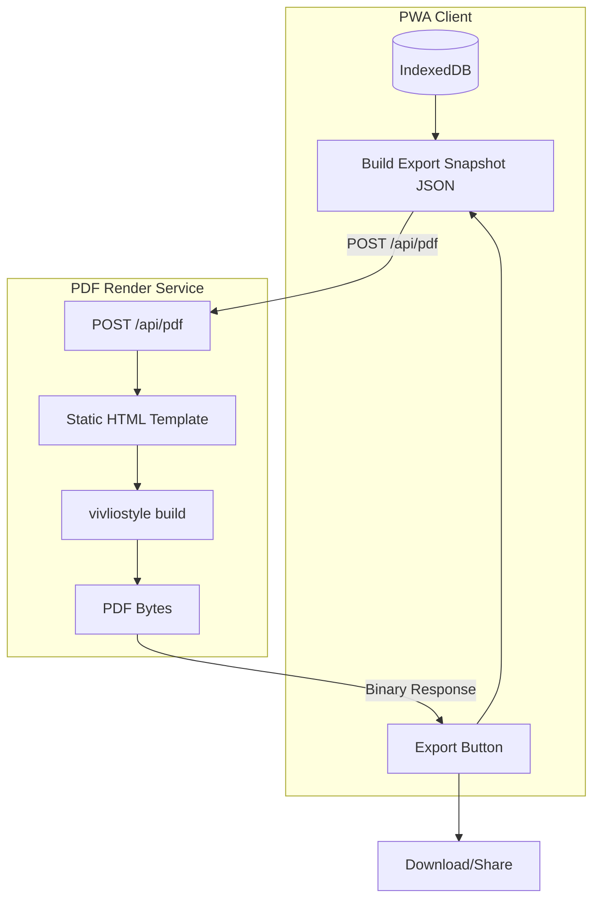

# Vivliostyle PDF Export Architecture

> Implement a server-side PDF render service using Vivliostyle CLI v10.1 for 100% consistent PDF exports from the Gear List Editor PWA.

## User Review Required

> [!IMPORTANT]
> **New Server-Side Dependency**: This architecture introduces a Node.js 20+ render service that will run as a companion server alongside the PWA. The PWA remains client-only for primary features, but PDF export becomes an **online action**.

> [!WARNING]
> **Licensing**: Vivliostyle CLI is AGPL-3.0. If deploying the render service to external customers, review AGPL obligations with counsel.

> [!CAUTION]
> **Offline Export**: When offline, PDF export will show "Export requires connection" instead of producing inconsistent browser-rendered PDFs.

## Architecture Overview



### Data Flow

1. **PWA (Client)**: Reads project from IndexedDB → Builds deterministic export snapshot JSON → POSTs to `/api/pdf`
2. **Render Service (Server)**: Receives JSON → Generates `index.html` + `print.css` → `vivliostyle build index.html` → Returns `application/pdf`

---

## Key Vivliostyle CLI Features Used

Based on official documentation:

| Feature | Source | Usage |
|---------|--------|-------|
| **Browser Version Pinning** | v10.1 Blog | `browser: 'chrome@143.0.7499.42'` in config |
| **ESM Config** | Config Docs | `import { defineConfig } from '@vivliostyle/cli'` |
| **Docker Render Mode** | Special Output Settings | `--render-mode docker` for environment consistency |
| **CSS Paged Media 3** | Supported Features | `@page`, margin boxes (`@bottom-center`), `page`/`pages` counters |
| **Theme CSS** | Config Reference | `theme: ['./print.css']` |

> [!NOTE]
> Docker render mode isolates fonts - must use web fonts (Google Fonts) or bundle fonts in workspace directory.

---

## Proposed Changes

### 1. PDF Snapshot Types

#### [NEW] `snapshotTypes.js`

file:///Users/lucazanner/Documents/GitHub/PDF Tool/Gear-list-editor/app/src/data/pdf/snapshotTypes.js

```javascript
/**
 * @typedef {Object} PdfExportSnapshot
 * @property {'1.0'} schemaVersion
 * @property {'gear-list-v1'} templateId
 * @property {string} documentId - Project UUID
 * @property {string} createdAtISO
 * @property {string} locale - e.g. 'en' or 'de'
 * @property {string} timezone - e.g. 'Europe/Berlin'
 * @property {Object} data
 * @property {import('../../types.js').Project} data.project
 * @property {{categories: number, items: number}} data.totals
 * @property {Object} [options]
 * @property {'A4' | 'Letter'} [options.paper]
 */

export function buildExportSnapshot(project, locale, timezone = Intl.DateTimeFormat().resolvedOptions().timeZone) {
  const totals = {
    categories: project.categories.length,
    items: project.categories.reduce((sum, cat) => sum + cat.items.length, 0)
  };
  return {
    schemaVersion: '1.0',
    templateId: 'gear-list-v1',
    documentId: project.id,
    createdAtISO: new Date().toISOString(),
    locale,
    timezone,
    data: { project, totals },
    options: { paper: 'A4' }
  };
}
```

---

### 2. PDF Export Service (Client-Side)

#### [NEW] `pdfExportService.js`

file:///Users/lucazanner/Documents/GitHub/PDF Tool/Gear-list-editor/app/src/data/pdf/pdfExportService.js

- `exportPdf(snapshot, serverUrl)` → POSTs JSON to `/api/pdf`, returns blob
- `downloadPdfBlob(blob, filename)` → Downloads via anchor click
- Offline detection with `navigator.onLine`

---

### 3. Server Package Structure

#### [NEW] Server Package

file:///Users/lucazanner/Documents/GitHub/PDF Tool/Gear-list-editor/server/

```
server/
├── package.json
├── src/
│   ├── index.js              # Express server entry
│   ├── routes/
│   │   └── pdf.js            # POST /api/pdf handler
│   └── templates/
│       └── gear-list-v1/
│           ├── template.js   # HTML generation function
│           └── print.css     # Paged-media print styles
├── vivliostyle.config.js     # Base config with browser pinning
└── Dockerfile                # Production container
```

#### [NEW] `server/package.json`

file:///Users/lucazanner/Documents/GitHub/PDF Tool/Gear-list-editor/server/package.json

```json
{
  "name": "gear-list-pdf-server",
  "type": "module",
  "version": "1.0.0",
  "engines": { "node": ">=20" },
  "scripts": {
    "start": "node src/index.js",
    "dev": "node --watch src/index.js",
    "test": "vitest run"
  },
  "dependencies": {
    "@vivliostyle/cli": "^10.1.0",
    "express": "^5.1.0",
    "cors": "^2.8.5"
  },
  "devDependencies": {
    "vitest": "^4.0.17"
  }
}
```

#### [NEW] `server/vivliostyle.config.js`

file:///Users/lucazanner/Documents/GitHub/PDF Tool/Gear-list-editor/server/vivliostyle.config.js

```javascript
// @ts-check
import { defineConfig } from '@vivliostyle/cli';

export default defineConfig({
  title: 'Gear List Export',
  language: 'en',
  size: 'A4',
  // Pin browser version for consistent output
  browser: 'chrome@143.0.7499.42',
  // Entry and output are set dynamically per job
});
```

---

### 4. PDF Route Handler

#### [NEW] `server/src/routes/pdf.js`

file:///Users/lucazanner/Documents/GitHub/PDF Tool/Gear-list-editor/server/src/routes/pdf.js

**Flow:**
1. Validate incoming `PdfExportSnapshot` schema
2. Create temp work directory
3. Generate `index.html` from template
4. Copy `print.css` to work dir
5. Write dynamic `vivliostyle.config.js` with entry/output
6. Execute: `vivliostyle build --config vivliostyle.config.js`
7. Stream PDF response, cleanup temp dir

---

### 5. Print CSS (Paged Media)

#### [NEW] `server/src/templates/gear-list-v1/print.css`

file:///Users/lucazanner/Documents/GitHub/PDF Tool/Gear-list-editor/server/src/templates/gear-list-v1/print.css

Based on existing `buildPrintableHtml` styles, converted to proper Paged Media 3 CSS:

```css
@import url('https://fonts.googleapis.com/css2?family=Inter:wght@400;600;700&display=swap');

@page {
  size: A4;
  margin: 18mm 16mm 20mm 16mm;
  
  @bottom-center {
    content: "Page " counter(page) " / " counter(pages);
    font-family: 'Inter', system-ui, sans-serif;
    font-size: 10pt;
    color: #64748b;
  }
}

@page :first {
  @bottom-center {
    content: none; /* No page number on first page */
  }
}

body {
  font-family: 'Inter', system-ui, sans-serif;
  color: #0f172a;
  line-height: 1.5;
}

/* Category sections avoid page breaks */
section.category {
  break-inside: avoid;
  margin-bottom: 24pt;
}

/* Force page break before specific elements */
.page-break {
  break-before: page;
}

/* Keep table rows together */
tr {
  break-inside: avoid;
}

/* ... additional styles ported from existing print.js */
```

---

### 6. HTML Template Generator

#### [NEW] `server/src/templates/gear-list-v1/template.js`

file:///Users/lucazanner/Documents/GitHub/PDF Tool/Gear-list-editor/server/src/templates/gear-list-v1/template.js

**Port the logic from existing `buildPrintableHtml`** but output a proper HTML file (not inline styles):

```javascript
export function generateHtml(snapshot) {
  const { project, totals } = snapshot.data;
  const locale = snapshot.locale;
  
  // Generate categories HTML
  const categoriesHtml = project.categories.map(/* ... */).join('');
  
  return `<!doctype html>
<html lang="${locale}">
<head>
  <meta charset="UTF-8">
  <title>${escapeHtml(project.name)} - Gear List</title>
  <link rel="stylesheet" href="print.css">
</head>
<body>
  <header>
    <h1>${escapeHtml(project.name)}</h1>
    <div class="meta">
      <div><strong>Client:</strong> ${escapeHtml(project.client || '—')}</div>
      <div><strong>Date:</strong> ${escapeHtml(project.shootDate || '—')}</div>
      <div><strong>Location:</strong> ${escapeHtml(project.location || '—')}</div>
      <div><strong>Contact:</strong> ${escapeHtml(project.contact || '—')}</div>
    </div>
  </header>
  ${categoriesHtml}
  <section class="notes">
    <strong>Notes:</strong> ${escapeHtml(project.notes || 'No notes added.')}
  </section>
</body>
</html>`;
}
```

---

### 7. Client Integration

#### [MODIFY] `App.jsx`

file:///Users/lucazanner/Documents/GitHub/PDF Tool/Gear-list-editor/app/src/App.jsx

- Replace `exportPdf` function to use new async service
- Add loading state during PDF generation
- Handle offline case with toast

**Before:**
```javascript
const exportPdf = useCallback((project, index) => {
  // ... window.open + print logic
}, [...]);
```

**After:**
```javascript
const [isPdfExporting, setIsPdfExporting] = useState(false);

const exportPdf = useCallback(async (project, index) => {
  if (!navigator.onLine) {
    setStatus(t('status.pdfExportOffline'));
    return;
  }
  setIsPdfExporting(true);
  setStatus(t('status.pdfExporting'));
  try {
    const snapshot = buildExportSnapshot(project, locale);
    await exportPdfToServer(snapshot);
    setStatus(t('status.pdfExportComplete'));
  } catch (err) {
    console.error('PDF export failed:', err);
    setStatus(t('status.pdfExportError'));
  } finally {
    setIsPdfExporting(false);
  }
}, [locale, setStatus, t]);
```

---

### 8. i18n Updates

#### [MODIFY] `en.json` / `de.json`

file:///Users/lucazanner/Documents/GitHub/PDF Tool/Gear-list-editor/app/src/i18n/en.json

Add keys under `status`:
```json
{
  "pdfExporting": "Generating PDF...",
  "pdfExportComplete": "PDF export downloaded successfully.",
  "pdfExportOffline": "PDF export requires an internet connection.",
  "pdfExportError": "PDF generation failed. Please try again."
}
```

---

## Verification Plan

### Automated Tests

#### Unit Tests (Vitest)

| Test File | Description | Command |
|-----------|-------------|---------|
| `app/test/unit/snapshotTypes.test.js` | Verify `buildExportSnapshot` produces valid schema | `cd app && npm test` |
| `app/test/unit/pdfExportService.test.js` | Mock fetch, verify blob handling + offline detection | `cd app && npm test` |
| `server/test/unit/template.test.js` | Verify HTML generation escapes content | `cd server && npm test` |
| `server/test/unit/pdf-route.test.js` | Verify route validation (mocked vivliostyle) | `cd server && npm test` |

### Integration Tests

```bash
# Start server, POST snapshot, verify PDF returned
cd server && npm run test:integration
```

### Manual Verification

**Prerequisites:**
1. Start both servers:
   ```bash
   # Terminal 1: PWA dev server
   cd app && npm run dev
   
   # Terminal 2: PDF render service
   cd server && npm install && npm run dev
   ```

2. Open browser to `http://localhost:5173/Gear-list-editor/`

**Test Steps:**

| Step | Action | Expected Result |
|------|--------|-----------------|
| 1 | Create a new project with name, client, date, location, contact | Project saved |
| 2 | Add 2 categories with 3 items each | Items visible |
| 3 | Click "Export PDF" button | Loading toast "Generating PDF..." appears |
| 4 | Wait for completion | PDF auto-downloads, toast "PDF export downloaded successfully." |
| 5 | Open downloaded PDF | Contains all project data, proper A4 formatting, page numbers |
| 6 | Enable DevTools Network → Offline mode | Checkbox checked |
| 7 | Click "Export PDF" | Toast "PDF export requires connection" appears |

**Golden PDF Comparison:**
- Compare output to existing example PDF: `250211_Equipmentliste_Bozen_Krimi_2025.pdf`
- Layout structure, fonts, table formatting should match

---

## Implementation Phases

### Phase 1: Server Package Setup (Est. 30 min)
1. Create `server/` directory structure
2. Initialize `package.json` with dependencies  
3. Create base Vivliostyle config with browser pinning
4. Setup Express with CORS + stub PDF route

### Phase 2: Print Template + CSS (Est. 45 min)
1. Port `buildPrintableHtml` styles to `print.css`
2. Create `template.js` HTML generator
3. Implement full PDF route handler with temp dir workflow

### Phase 3: Client Integration (Est. 30 min)
1. Create `buildExportSnapshot` function
2. Create `pdfExportService.js` with offline detection
3. Update `App.jsx` to use new export flow
4. Add i18n keys

### Phase 4: Tests + Verification (Est. 45 min)
1. Write unit tests for client snapshot + service
2. Write server route + template tests
3. Manual browser verification
4. Compare output to existing PDF examples

---

## Questions for User

1. **Server Port**: Fixed 3001, or configurable via `PORT` env var?

2. **Fallback Mode**: Keep browser print (`window.print()`) as fallback when server unavailable, or require server for all exports?

3. **Docker**: Include production Dockerfile now, or defer?

4. **Font Licensing**: Using Google Fonts (Inter) - okay for your use case?
