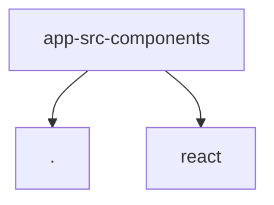

# Module: app/src/components

[← Back to INDEX](../../INDEX.md)

**Type:** implicit | **Files:** 6

## Files

| File | Lines | Large |
| ---- | ----- | ----- |
| `app/src/components/HelpPanel.jsx` | 67 |  |
| `app/src/components/ProjectDashboard.jsx` | 296 |  |
| `app/src/components/ProjectWorkspace.jsx` | 329 |  |
| `app/src/components/SettingsPanel.jsx` | 133 |  |
| `app/src/components/TemplateManager.jsx` | 114 |  |
| `app/src/components/TypeaheadInput.jsx` | 75 |  |

---

## External Dependencies

Dependencies from other modules:

- `./TypeaheadInput.jsx`
- `react`
