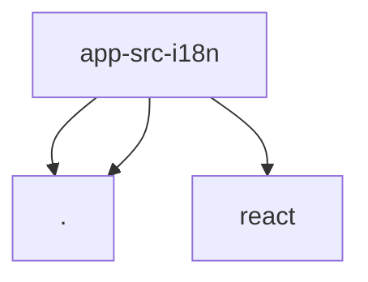

# Module: app/src/i18n

[← Back to INDEX](../../INDEX.md)

**Type:** js/ts | **Files:** 1

**Entry point:** `app/src/i18n/index.js`

## Files

| File | Lines | Large |
| ---- | ----- | ----- |
| `app/src/i18n/index.js` | 139 |  |

---

## External Dependencies

Dependencies from other modules:

- `./de.json`
- `./en.json`
- `react`
