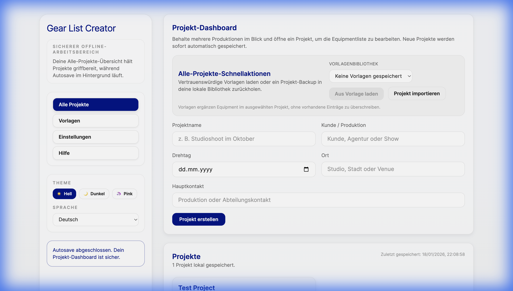

# Gear List Editor

A **Local-First** web application for creating and managing professional film equipment lists. Built with **Vite + React + Tailwind CSS**.

[](https://hugo9809.github.io/Gear-list-editor/)



## ✨ Features

-   **Project Management**: Create, edit, and organize multiple equipment list projects.
-   **PDF Export**: Generate professional, printable PDF gear lists.
-   **100% Offline**: Works without an internet connection. All data stays on your device.
-   **Auto-Save**: Changes are automatically persisted to IndexedDB.
-   **Redundant Backups**: Critical data is mirrored to OPFS for crash recovery.
-   **Export/Import**: Full project state can be exported to a JSON file.
-   **Themes**: Multiple themes available (Bright, Dark, Pink Light, Pink Dark).
-   **i18n**: Supports English and German (`en`, `de`).

## 🔐 Data Safety & Recovery

-   **Local-first storage**: All project data remains on your device (IndexedDB + OPFS).
-   **Auto-save**: Edits are saved automatically while you work.
-   **Manual backups**: Export a JSON backup before major changes or device swaps.
-   **Restoration options**: Restore from an exported backup or the latest device backup if needed.

## 🚀 Quick Start

```bash
# 1. Clone the repository
git clone https://github.com/Hugo9809/Gear-list-editor.git

# 2. Navigate to the app directory
cd Gear-list-editor/app

# 3. Install dependencies
npm install

# 4. Start the development server
npm run dev
```
The dev server will run at `http://localhost:5173/Gear-list-editor/`.

## 📜 Available Scripts

| Script             | Description                                      |
|--------------------|--------------------------------------------------|
| `npm run dev`      | Start Vite development server with HMR           |
| `npm run build`    | Build for production to `app/dist/`              |
| `npm run build:root` | Build for GitHub Pages root deployment        |
| `npm run preview`  | Preview the production build locally            |
| `npm test`         | Run the Vitest test suite                        |

## 🛠️ Tech Stack

| Layer       | Technology                               |
|-------------|------------------------------------------|
| Build       | [Vite](https://vitejs.dev/)              |
| Frontend    | [React](https://react.dev/) (JSX, Hooks) |
| Styling     | [Tailwind CSS](https://tailwindcss.com/) |
| Routing     | [React Router](https://reactrouter.com/) |
| Storage     | IndexedDB + OPFS (Local-First)           |
| Testing     | [Vitest](https://vitest.dev/)            |

## 📖 Documentation

-   **[Architecture](./docs/ARCHITECTURE.md)**: System overview, stack, and directory structure.
-   **[Data Storage](./docs/DATA_STORAGE.md)**: IndexedDB, OPFS, and backup strategies.
-   **[Contributing](./docs/CONTRIBUTING.md)**: Development setup, testing, and code style.
-   **[Codebase Map](./CODEBASE_MAP.md)**: Agent-friendly navigation and skill reference.

## 🌐 Deployment (GitHub Pages)

The app is configured for deployment on GitHub Pages under the `/Gear-list-editor/` base path.

```bash
cd app
npm run build
```

The static output in `app/dist/` can be deployed to any static file host.

> **Tip:** For custom base paths, set `VITE_BASE_URL` before building:
> ```bash
> VITE_BASE_URL=/my-repo/ npm run build
> ```

## ❓ FAQ

<details>
<summary><strong>How do I back up my data?</strong></summary>

Go to **Settings** → **Download full backup**. This downloads a `.json` file containing all your projects, templates, and settings. You can import it later using **Import full backup**.
</details>

<details>
<summary><strong>How do I restore data if something goes wrong?</strong></summary>

Open **Settings** and choose **Import full backup** to restore a previously exported `.json` file. If you did not export manually, use **Restore from device backup** to recover the latest on-device snapshot.
</details>

<details>
<summary><strong>Can I use this offline?</strong></summary>

Yes! The app works 100% offline. All data is stored locally in your browser using IndexedDB and OPFS. No server or internet connection is required.
</details>

<details>
<summary><strong>How do I change the theme?</strong></summary>

Use the theme buttons in the sidebar: **Bright**, **Dark**, or **Pink** variants.
</details>

<details>
<summary><strong>Why isn't my data syncing across devices?</strong></summary>

This is a **Local-First** app. Data is stored only on the device you use. To transfer data, export a backup on one device and import it on another.
</details>

## 📝 License

Private repository.
