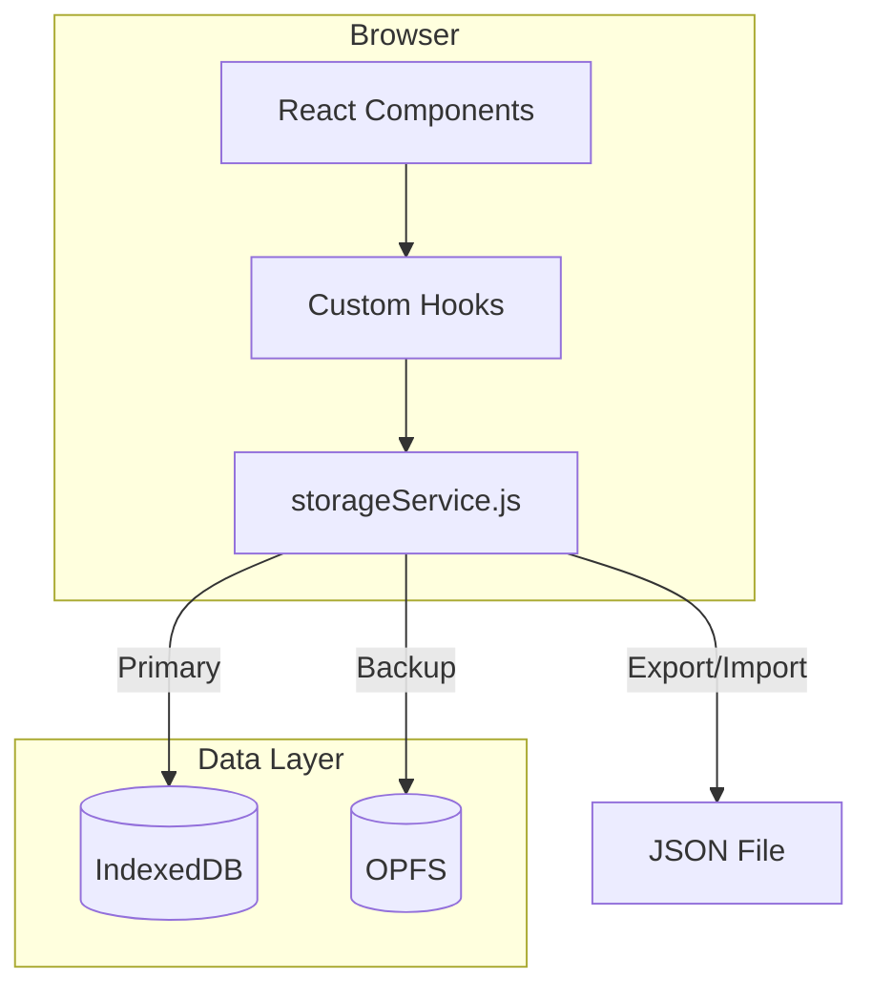
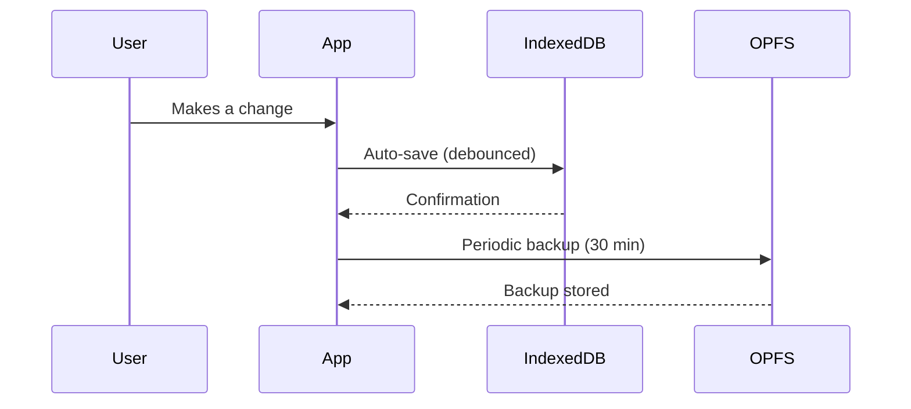

# Architecture Overview

> **Stack**: Vite + React + Tailwind CSS  
> **Architecture**: Local-First (IndexedDB + OPFS)

## 🗺️ System Diagram



## 🏗️ Technology Stack

| Layer       | Technology                                                                 |
|-------------|---------------------------------------------------------------------------|
| Build       | [Vite](https://vitejs.dev/) (Native ESM)                                  |
| Frontend    | [React](https://react.dev/) (JSX, Functional Components, Hooks)           |
| Language    | JavaScript (ES2022+ Modules)                                              |
| Styling     | [Tailwind CSS](https://tailwindcss.com/) + CSS Modules                    |
| Routing     | [React Router](https://reactrouter.com/) v7                               |
| Storage     | IndexedDB (primary) + OPFS (backup)                                       |
| Testing     | [Vitest](https://vitest.dev/)                                             |

## 📂 Directory Structure

```
Gear-list-editor/
├── app/                   # Main application
│   ├── src/
│   │   ├── components/    # UI Components
│   │   ├── data/          # Data layer (storageService, migrations)
│   │   ├── features/      # Feature modules
│   │   ├── hooks/         # Custom React hooks
│   │   ├── i18n/          # Translations (en, de)
│   │   ├── shared/        # Shared utilities and hooks
│   │   └── utils/         # General utilities
│   ├── test/              # Test configuration
│   └── vite.config.js     # Vite configuration
├── assets/                # Static assets (screenshots)
├── docs/                  # Documentation
└── README.md              # Project entry point
```

## 🗝️ Key Concepts

### Local-First Data



- **Auto-Save**: Changes are persisted immediately to IndexedDB with debouncing (700ms delay).
- **Redundancy**: Every 30 minutes, the full state is mirrored to OPFS.
- **Export/Import**: Users can export to JSON for backup or device transfer.

### Component Architecture

We use a **feature-based** folder structure:
- `features/<feature-name>/` contains related components, hooks, and utilities.
- `shared/` contains cross-cutting concerns like `useProjects`, `useStorageHydration`.
- `data/` contains all persistence logic, isolated from UI.

## 📦 Key Modules

| Module | Purpose | Path |
|--------|---------|------|
| `storageService.js` | Central data persistence facade | `app/src/data/` |
| `migrate.js` | Schema migrations | `app/src/data/` |
| `normalize.js` | Data validation and normalization | `app/src/data/` |
| `useProjects.js` | Project state management hook | `app/src/shared/hooks/` |
| `useStorageHydration.js` | Initial data loading | `app/src/shared/hooks/` |

---

*See also: [Data Storage](./DATA_STORAGE.md) for deep details on IndexedDB and OPFS.*
