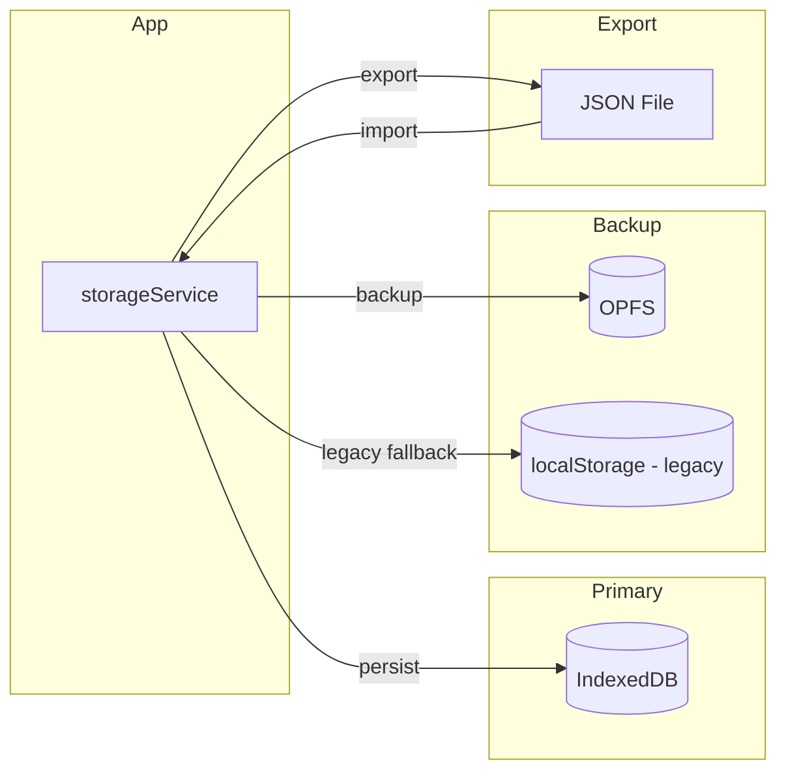
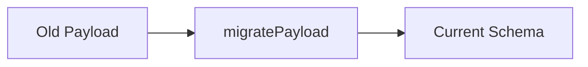

# Data Storage

This document describes the **Local-First** data storage architecture used by Gear List Editor.

## 🎯 Design Philosophy

The application is designed to work **100% offline**. There is no backend server. All user data is stored locally in the browser using two complementary technologies:

| Technology | Purpose | Data Type |
|------------|---------|-----------|
| **IndexedDB** | Primary storage | Projects, gear lists, settings |
| **OPFS** | Redundant backup | Full state snapshots |

## 📦 Storage Architecture



## 🔑 Storage Keys

| Key | Storage | Description |
|-----|---------|-------------|
| `gear-list-editor.data` | localStorage | Legacy primary storage (migrated) |
| `gear-list-editor.backup` | localStorage | Legacy backup |
| `gear-list-editor` | IndexedDB | Current primary storage |
| `gear-list-backup.json` | OPFS | Periodic auto-backup |

## ⚙️ storageService API

The `storageService.js` module is the single point of contact for all data operations.

### Factory Function

```javascript
import { createStorageService } from './data/storageService.js';

const storage = createStorageService();
```

### Key Methods

| Method | Description |
|--------|-------------|
| `loadState()` | Load persisted state from IndexedDB/OPFS |
| `scheduleAutosave(state)` | Queue a debounced save |
| `saveNow(state)` | Immediately persist state |
| `exportBackup(state)` | Download a JSON backup |
| `importBackup(rawText, currentState)` | Import and merge a backup |
| `restoreFromBackup()` | Restore from OPFS backup |
| `listAutoBackups()` | List available auto-backups |
| `factoryReset()` | Delete all stored data |
| `dispose()` | Clean up timers and intervals |

### Auto-Save Behavior

```javascript
// Debounced save: waits 700ms of inactivity before writing
storage.scheduleAutosave(state);

// Immediate save: bypasses debounce
storage.saveNow(state);
```

## 🔄 Migration System

The `migrate.js` module handles schema evolution.



When loading data, `migratePayload` automatically upgrades old data formats to the current schema version.

## 📤 Export & Import

### Export
Users can export their entire data set (projects, settings, themes) to a `.json` file.

```javascript
const json = storage.exportBackup(state);
// Triggers browser download
```

### Import
```javascript
const result = await storage.importBackup(rawText, currentState);
if (result.success) {
  // result.payload contains the merged state
}
```

The import system uses `mergePayloads` to intelligently combine imported data with existing state, avoiding duplicates.

## 🧯 Backup & Restore Workflow

Use the settings panel to keep data safe even when working offline:

1. **Download full backup** before major edits, device handoffs, or cleanup operations.
2. **Import full backup** to merge a `.json` backup into the current state without overwriting everything.
3. **Restore from device backup** to recover the latest on-device snapshot saved to OPFS.

These workflows prioritize keeping more data rather than risking accidental loss.

---

*See also: [Architecture](./ARCHITECTURE.md) for the overall system design.*
